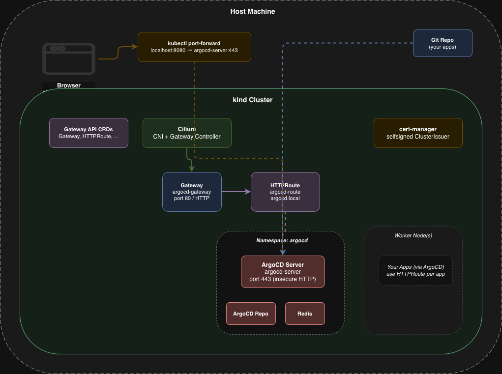

# kind-apps-cluster

Local Kubernetes cluster with ArgoCD and Gateway API — all managed by an idempotent bash script.

## Architecture

> Editable diagram: [`docs/architecture.drawio`](docs/architecture.drawio) — open in [draw.io](https://app.diagrams.net/).




### How traffic reaches ArgoCD

```
Browser ──► localhost:80 (host machine)
                 │
                 ▼
         kind cluster port mapping (80)
                 │
                 ▼
         cloud-provider-kind Gateway Controller
                 │
                 ▼
         Gateway: main-gateway
                 │
                 ▼
         HTTPRoute: argocd.local
                 │
                 ▼
         argocd-server Service (:443)
                 │
                 ▼
         ArgoCD Pod (HTTP, insecure mode)
```

**Access:** Add `127.0.0.1 argocd.local` to `/etc/hosts` and visit `http://argocd.local`

Gateway API handles **in-cluster routing** for all deployed applications. External access via cloud-provider-kind provides LoadBalancer support for kind clusters.

## Prerequisites

| Tool     | Auto-installed? |
|----------|----------------|
| `kind`   | yes            |
| `kubectl`| yes            |
| `helm`   | yes            |
| Docker   | **no** — must be running |

> **Docker** (or any OCI-compatible runtime) is required by `kind` and must be installed and running before you start.

## Quick Start

```bash
# 1. Clone the repo
git clone <repo-url> && cd kind-apps-cluster

# 2. Review / edit config (optional)
vim config.conf

# 3. Run full deploy
./setup.sh          # interactive menu
./setup.sh -y       # non-interactive full deploy
```

After the deploy completes:
1. Add to `/etc/hosts`: `127.0.0.1 argocd.local`
2. Visit `http://argocd.local`
3. Login with credentials shown in deploy output

## Usage

### Interactive Menu

```
  1)  Full deploy (cluster + gateway + argocd + apps)
  2)  Create / verify kind cluster only
  3)  Install Gateway API + cloud-provider-kind
  4)  Install ArgoCD
  5)  Apply ArgoCD applications from ./argocd-apps
  6)  Show status of all components
  7)  Get ArgoCD admin password
  8)  Port-forward ArgoCD (http://localhost:8080)
  9)  Delete cluster
  0)  Exit
```

Every option is **idempotent** — you can run any of them multiple times safely.

### Custom Config File

```bash
./setup.sh /path/to/my-config.conf
```

## Accessing ArgoCD

After deploy completes, cloud-provider-kind bridges the kind cluster network to your host machine using Docker's host network mode. ArgoCD is accessible directly via hostname without port-forward.

**Quick Setup:**
```bash
# 1. Add to /etc/hosts
echo "127.0.0.1 argocd.local" | sudo tee -a /etc/hosts

# 2. Visit http://argocd.local
# 3. Login with admin credentials (shown in deploy output)
```

**Get ArgoCD admin password:**
```bash
./setup.sh   # option 7 — Get ArgoCD admin password
```

**Alternative: kubectl Port-Forward (if direct access doesn't work)**
```bash
./setup.sh   # option 8 — Port-forward ArgoCD
```
- **URL:** `http://localhost:8080`
- **User:** `admin`
- **Password:** (shown after deploy)

## Configuration (`config.conf`)

| Variable | Default | Description |
|----------|---------|-------------|
| `CLUSTER_NAME` | `kind-apps-cluster` | kind cluster name |
| `K8S_VERSION` | `v1.32.3` | Kubernetes version (kind node image tag) |
| `WORKER_NODES` | `1` | Number of worker nodes |
| `ARGOCD_NAMESPACE` | `argocd` | Namespace for ArgoCD |
| `ARGOCD_VERSION` | `stable` | ArgoCD manifest version |
| `ARGOCD_APPS_DIR` | `./argocd-apps` | Directory with Application/ApplicationSet YAMLs |
| `GATEWAY_API_VERSION` | `v1.2.0` | Gateway API CRD version |
| `GATEWAY_CLASS_NAME` | `cloud-provider-kind` | GatewayClass to use |
| `AUTO_INSTALL_TOOLS` | `true` | Auto-install missing CLI tools |
| `HTTP_PORT` | `80` | Host port mapped to kind node |
| `HTTPS_PORT` | `443` | Host port mapped to kind node |

## Components

| Component | Purpose |
|-----------|---------|
| **kind** | Local K8s cluster running in Docker |
| **cloud-provider-kind** | Gateway Controller + LoadBalancer provider for kind (uses host network to bridge networking) |
| **Gateway API** | Standard ingress (`Gateway`, `HTTPRoute` CRDs) — cloud-provider-kind is the controller |
| **ArgoCD** | GitOps continuous delivery — deploys apps from `argocd-apps/` |

## Deploying Applications

Drop `Application` or `ApplicationSet` YAML files into `argocd-apps/`. They are applied during full deploy or via menu option 6.

```yaml
# argocd-apps/my-app.yaml
apiVersion: argoproj.io/v1alpha1
kind: Application
metadata:
  name: my-app
  namespace: argocd
spec:
  project: default
  source:
    repoURL: https://github.com/org/repo.git
    targetRevision: main
    path: k8s/
  destination:
    server: https://kubernetes.default.svc
    namespace: my-app
  syncPolicy:
    automated:
      prune: true
      selfHeal: true
```

## Project Structure

```
kind-apps-cluster/
├── setup.sh                # Main entry point (menu + non-interactive)
├── config.conf             # All configurable parameters
├── lib/
│   ├── utils.sh            # Logging, wait helpers
│   ├── tools.sh            # Tool detection & installation
│   ├── kind.sh             # kind cluster lifecycle (health checks)
│   ├── argocd.sh           # ArgoCD install, insecure config, port-forward
│   └── gateway-api.sh      # Gateway API CRDs + cloud-provider-kind
├── argocd-apps/
│   ├── README.md
│   └── example-guestbook.yaml
└── docs/
    └── architecture.drawio  # Editable diagram (open in draw.io)
```

## Idempotency

The script is safe to re-run at any time:

- **Cluster**: detects unhealthy containers and recreates automatically.
- **Helm charts** (ArgoCD): `helm upgrade --install` reconciles to desired state.
- **Gateway API**: CRDs are reapplied, cloud-provider-kind container is restarted if needed.
- **ArgoCD**: config set via `argocd-cmd-params-cm` ConfigMap + rollout restart.
- **ArgoCD apps**: `kubectl apply` is naturally idempotent.

## Troubleshooting

**Docker not running**
```
ERROR: failed to create cluster: could not find a container runtime
```
→ Start Docker Desktop or your container runtime.

**Ports 80/443 in use**
→ Edit `HTTP_PORT` / `HTTPS_PORT` in `config.conf`.

**Cannot reach `argocd.local` after deploy**
```bash
# 1. Verify /etc/hosts entry
grep "argocd.local" /etc/hosts
# Should show: 127.0.0.1 argocd.local

# 2. Verify Gateway and HTTPRoute are created
kubectl get gateway -n argocd
kubectl get httproute -n argocd

# 3. Check cloud-provider-kind is running
docker ps | grep cloud-provider-kind

# 4. Check Gateway status
kubectl describe gateway main-gateway -n argocd
```

**cloud-provider-kind container not running**
```bash
# Check if it exists and why it stopped
docker ps -a | grep cloud-provider-kind

# Logs from the container
docker logs cloud-provider-kind

# Restart it manually
docker run -d --name cloud-provider-kind --rm --network host \
  -v /var/run/docker.sock:/var/run/docker.sock \
  registry.k8s.io/cloud-provider-kind/cloud-controller-manager:v0.28.0
```

**ArgoCD UI not loading**
```bash
kubectl get pods -n argocd                                     # check pods
kubectl get configmap argocd-cmd-params-cm -n argocd -o yaml  # verify insecure=true
kubectl port-forward -n argocd svc/argocd-server 8080:443     # manual port-forward
```

**Gateway API not routing traffic**
```bash
kubectl get gateway -A        # check Gateway status
kubectl get httproute -A      # check HTTPRoute status
kubectl logs -n kube-system -l app=cloud-provider-kind # check controller logs
```

**Reset everything**
```bash
./setup.sh   # option 9 — Delete cluster
./setup.sh   # option 1  — Full deploy
```

## License

MIT
